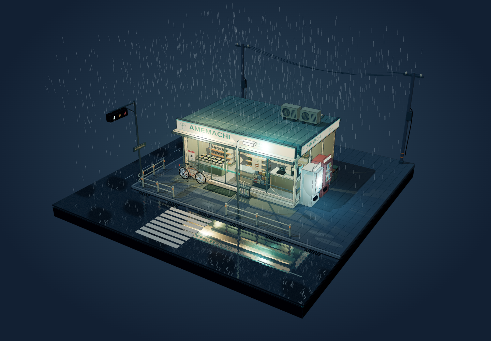
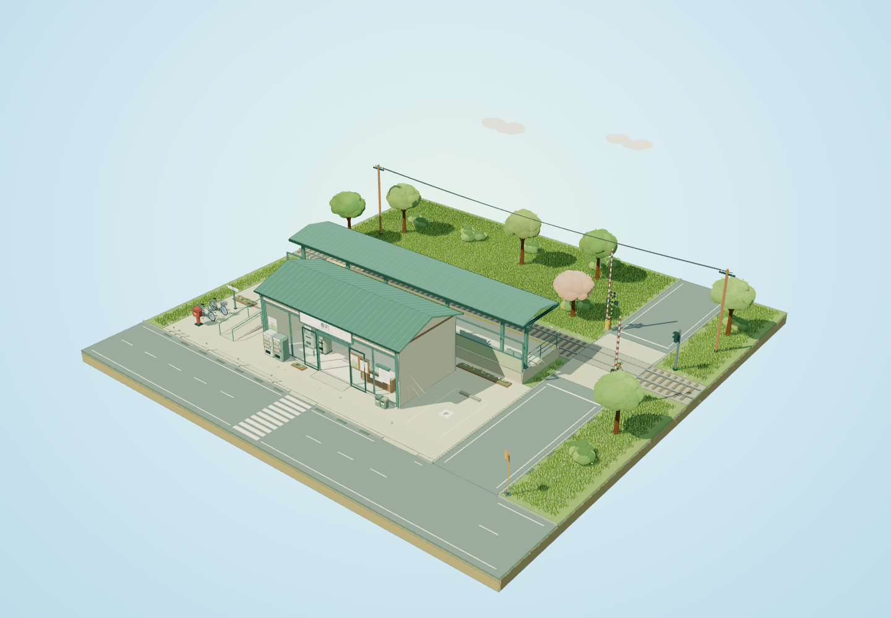

# 4fun

A collection of interactive 3D scenes and small web toys. The scenes include standalone HTML files, reusable generation prompts, and rendered preview images. Web apps live in `apps/`.

## Apps

[Pomu](apps/pomu) is a little slime companion built with Next.js, TypeScript, Three.js and Tailwind CSS. Pet, stretch and split your slime, customize its colors, or feed it mochi using a wooden slingshot. Small slimes grow as they eat and reunite when left alone.

Pomu requires Node.js 20.9 or later and pnpm 12.6.0:

```sh
cd apps/pomu
pnpm install --frozen-lockfile
pnpm dev
```

Open `http://localhost:3000`. Use the in-app help for mouse, touch and keyboard controls. For a production server, run `pnpm build` followed by `pnpm start`.

[Room Studio](apps/room-studio) combines an editable 2D floor plan with a synchronized 3D interior. Add connected rooms, resize shared walls, arrange furniture and explore materials and daylight. Desktop shows both views; mobile uses tabs. Its Modern Residence example includes two furnished floors, a double bedroom plus two single bedrooms, two full upstairs bathrooms, a guest WC, upstairs laundry, a complete fitted kitchen and a real stair opening, with a contemporary source-model furniture library. It remembers successful 3D activation on this browser and includes graphics availability/retry messages, warm lamps at dusk, visible material transitions, GLB furniture import from files/direct links, undo/redo, local save and portable JSON backups containing model files. [Prompt](apps/room-studio/PROMPT.md) · [Preview](apps/room-studio/images/preview.png) · [Mobile](apps/room-studio/images/mobile.png).

Room Studio requires Node.js 20.9+ and pnpm 9.15.9:

```sh
cd apps/room-studio
pnpm install --frozen-lockfile
pnpm dev --port 3012
```

Open `http://localhost:3012`. See the app's README for controls, scope and performance checks.

## Scenes

| Scene | HTML | Prompt | Preview |
| --- | --- | --- | --- |
| Amemachi — Rainy Night Konbini | [Open file](scenes/rainy-konbini/index.html) | [Generation prompt](scenes/rainy-konbini/PROMPT.md) | [Overview](scenes/rainy-konbini/images/preview.png) · [Detail](scenes/rainy-konbini/images/detail.png) |
| Harumachi — Spring Morning Station | [Open file](scenes/spring-station/index.html) | [Generation prompt](scenes/spring-station/PROMPT.md) | [Overview](scenes/spring-station/images/preview.png) · [Detail](scenes/spring-station/images/detail.png) · [Platform](scenes/spring-station/images/platform.png) · [Vegetation](scenes/spring-station/images/vegetation.png) · [Passing train](scenes/spring-station/images/train.png) · [Local stop](scenes/spring-station/images/stopping-train.png) · [Interior](scenes/spring-station/images/train-window.png) · [Boarding](scenes/spring-station/images/train-boarding.png) · [Cab](scenes/spring-station/images/train-cab.png) · [Middle car](scenes/spring-station/images/train-middle.png) |





## View a scene

Download or clone this repository and open a scene's `index.html` in a modern browser with WebGL support. The GitHub file view displays source code; open the downloaded HTML to interact with the scene.

Each scene works offline, with no installation, build step, or server required.

- Drag to rotate; right-drag to pan; scroll to zoom.
- On touch screens, drag with one finger to rotate and use two fingers to pan or pinch to zoom.
- Press `Home` to reset the view.

## Folder convention

```text
scenes/
  scene-name/
    index.html
    PROMPT.md
    images/
      preview.png
      detail.png
```

Use a descriptive folder name for each new scene. Keep its code in `index.html`, its reusable prompt in `PROMPT.md`, and its rendered images in `images/`. Link the scene from the table above.

The scenes embed Three.js r160.1, OrbitControls, and Reflector. Their MIT license notice is included in the HTML. Preview images are captures of the actual HTML scene.
