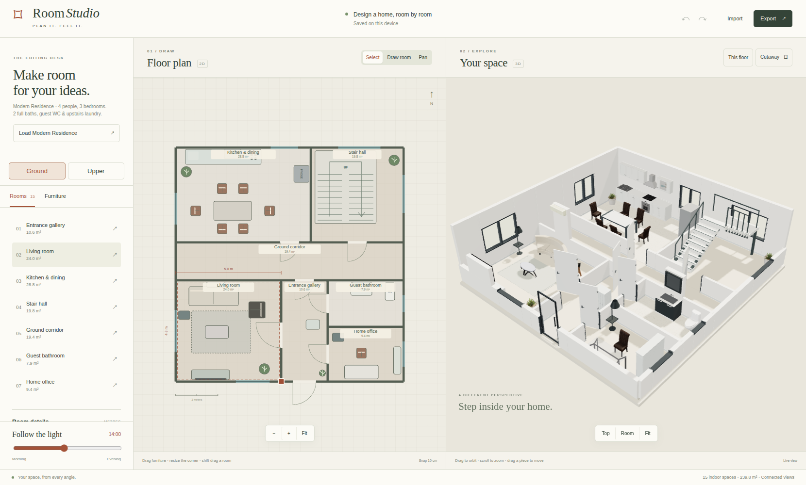

# Room Studio

A two-storey interior-planning app built with Next.js, React, TypeScript and Three.js. Edit a measured SVG floor plan and explore the same rooms in a warm, interactive 3D cutaway. Desktop shows both views; mobile switches between them.



## Run

Requires Node.js 20.9+ and pnpm 9.15.9.

```sh
cd apps/room-studio
pnpm install --frozen-lockfile
pnpm dev --port 3012
```

Open <http://localhost:3012>. For a local production preview, run `pnpm build` and then `pnpm start --port 3012`.

```sh
pnpm test
pnpm typecheck
pnpm build
```

## Use

- Select **Enable 3D** in the 3D panel the first time. After successful startup, this browser remembers your choice and automatically opens 3D on later visits when the panel is visible and graphics remain available. A visible panel checks WebGL 2 availability first; the renderer and furniture models load only after a new or remembered activation. On mobile, open **Your space / 3D** first. Unsupported or blocked graphics show a clear message while 2D editing stays available. **Check again** repeats the capability check; **Try again** retries startup after failure or lost graphics context. The app cannot change browser graphics settings.
- The **Modern Residence** example has 239.8 m² across two floors: a two-person main bedroom (30.7 m²), two one-person bedrooms (14.4 m² each), two full upstairs bathrooms (ensuite/shared), a guest WC downstairs, living room, kitchen/dining, upstairs laundry, home office and a U-shaped staircase. **Ground / Upper** switches both editors; **This floor / Whole house** changes the 3D inspection view. Upper floors have a real stair opening and guards.
- **Load Modern Residence** loads the finished interior example and can be undone. Gardens, cars and parking are omitted. Opening a previously saved project with outdoor spaces removes those spaces while preserving indoor edits; **Undo** restores its previous layout. Existing apartment plans stay readable.

- Select a room, then change its width, depth, name, floor or paint in the editing desk. Drag its lower-right handle to resize. Shared edges move together, carrying furniture in adjoining rooms.
- Choose **Draw room**, then drag a rectangle in empty space against an existing wall (minimum 1.8 × 1.8 m). Instructions and rejected-drawing reasons appear above the plan; the connecting doorway must stay clear of furniture. Rooms need a shared edge long enough for a connecting door. Use **Fit**, zoom buttons or the pan tool to find more drawing space. Shift-drag moves a room.
- Open **Furniture** to place a piece in free space in the selected room. Drag it in either view. Its width, depth, rotation and removal controls appear below the editing desk. Focus a 2D piece and use arrow keys for 10 cm steps.
- In 3D, drag empty space to orbit, scroll or pinch to zoom, and use **Room**, **Top** or **Fit** for camera presets. **Cutaway / Full walls** changes the inspection view. Selection uses a floor rectangle matching the furniture’s width, depth and rotation. While dragging, the furniture lifts 10 cm above the floor; its footprint turns green when the position fits and red when it is blocked. Furniture lowers back to the floor on release. Releasing at a blocked position restores the starting position without adding an undo step. On touch screens, use the 2D zoom buttons and pan tool.
- Move the daylight slider to explore morning, afternoon and evening. Existing floor lamps gradually glow warm orange from 17:00 to 19:30, illuminating nearby surfaces as the ambient sky darkens. Returning to daytime switches them off. Undo/redo works with the header buttons and Ctrl/⌘ Z / Shift Z.
- Change floor or wall paint to watch the new finish spread across the selected room over about one second. A new choice replaces the previous transition; reduced-motion preferences apply the finish immediately.
- Under **Furniture → Import 3D model**, choose a `.glb` file or load a direct HTTP(S) GLB link. Check its name and width/depth/height in metres, then choose **Add model to room**. Imported pieces use the same placement rules and appear in **Your models** for reuse. Their dimensions, rotation and height remain editable; imported lights and cameras do not change the room lighting/view.
- Plans save on this browser after completed edits. Model files are kept in IndexedDB; plan metadata stays in localStorage. **Export** downloads a portable JSON backup including every model file; **Import** validates geometry and files before replacing the plan. Storage failures leave the editor usable and ask you to export a backup. If a model file is missing, importing its GLB again restores its instances.

[Enable 3D](images/enable-3d.png) · [Remembered activation](images/automatic-3d.png) · [Evening lights](images/night.png) · [Upper floor](images/upper.png) · [Kitchen detail](images/kitchen.png) · [Furniture library](images/furniture.png) · [Import preview](images/import.png) · [Material reveal in progress](images/material-reveal.png)

## Geometry and scope

Room sides are 1.8–14 m, with a maximum of 24 connected rectangular rooms and 160 pieces. The house has explicit door/window openings on actual shared/exterior walls. Rooms added in either floor get a connecting doorway; old apartments retain automatic openings. Doors have 0.9 m openings and a reserved 0.7 m approach on each side. Wall faces use their own room's paint.

Solid furniture cannot overlap, block those doorway zones or leave its floor; it keeps at least 8 cm from room boundaries. Rugs may sit beneath furniture. Models have grounded legs or plinths, supported tops and real door/window holes. Resize attempts that lose those clearances are rejected.

This version uses axis-aligned rectangular rooms and floor-aware placement. It does not support arbitrary polygons, manual door placement, construction-code checking or imported floor-plan images. It is a visual planning tool with conservative rectangular furniture footprints.

## Modern furniture

The house uses real source models for furniture, kitchen modules, sanitary fixtures, appliances, storage, mirrors and lights. Twenty-three self-hosted GLBs provide 25 catalog types and 62 source-model instances in the 64-piece example. The complete library is about 22.41 MB; the active floor loads only the models it uses. Sources include Poly Haven / Innerscene CC0 models and artist models distributed by Sweet Home 3D under CC BY 3.0. [Authors, sources, changes and license notices](public/models/furniture/README.md).

The fitted kitchen combines actual sink, hob, oven front, four base modules and three upper cabinets, including a glass-front cabinet with visible plates and bowls on its shelves. The 3.6 m preset run provides preparation space and storage; sink/base worktops align. Appliances retain available baked controls and material maps. Contemporary white, charcoal, ceramic, glass, neutral fabric and brushed-metal finishes replace selected wood/colored finishes. Entry glazing, flush room doors, narrow aluminium window frames and warm-white walls follow the same palette. The staircase, shell, door/window joinery, trim and thin woven rug are procedural architectural/fabric surfaces.

The double bedroom uses a dedicated two-pillow double-bed model; one-person rooms retain single-bed models. The picker shows our own renders of the GLBs. Models load once and repeated instances share geometry, textures and materials. Model geometry stays intact during movement; no provider API or CDN is needed at runtime.

## Imported model limits

Use self-contained, static GLB 2.0 furniture with embedded geometry and PNG/JPEG textures. Direct links must allow cross-origin access; model-store webpages are not downloadable model links. Animated/skinned models, external resource files and KTX2 compressed textures are rejected. Draco and Meshopt decoders come from the installed Three.js addons; Draco files are served locally with their [Apache 2.0 license](public/decoders/draco/LICENSE).

Each asset is limited to 8 MB, 60,000 triangles, 64 meshes, 32 materials and 8 million texture pixels (maximum 4096 px per side). A plan allows 8 unique imported assets, 24 MB of model files and 300,000 imported triangles across instances. Width/depth are 0.2–4 m and height is 0.05–4 m. Large source dimensions are scaled to a starting size; check the measurements before adding. Model geometry and materials stay intact within these limits.

## Performance and review

Three.js loads separately from the editing UI after Enable 3D or a remembered activation. A short capability probe releases its graphics context; the main renderer is created on first-time request or a remembered activation, including on mobile. If browser storage is blocked or cleared, the first-time CTA returns; this preference is separate from plan data and backups. Rendering runs on demand, stops when idle/hidden, and resumes for edits or camera movement. Furniture templates merge parts by material once and share their geometry; dragging updates transforms. Floor textures and wall geometry are reused. Imported instances share decoded geometry/materials, and moving them changes their transforms. Material reveals use temporary shader masks and release their resources when complete. Pointer work is coalesced to animation frames. Four fixed, unshadowed indoor light slots bound lighting cost; every visible lamp shade glows, with at most four lamps illuminating nearby surfaces. Moving/removing lamps and switching floors update those sources without adding shadow passes. One 2048 px shadow map and a fixed maximum pixel ratio of 1.75 bound rendering cost; model detail, materials and shadows stay fixed during interaction.

All 64 pieces were measured from actual rendered vertices against their floor contact and declared footprints; both floors and the complete house had no footprint/support findings. The preset also checks clear working space in front of wardrobes, sanitary fixtures and the washer. Non-painted architectural parts are merged by material, keeping their original triangles and paint-reveal surfaces. A ground-floor frame refreshing shadows reported 383 calls / 606,370 triangles / 98 geometries / 31 textures. Figures include the shadow pass; camera-only work is lower.

Nineteen native geometry/import/house/graphics/lighting checks, strict types and the production build pass. Desktop review covers source-model loading, 3D green/red placement feedback, lift/lower, invalid drop, one-step undo, floor switching, imports, backups, material reveal, persistence and stable idle resources. Mobile review covers lazy WebGL, no overflow, both floors and native touch edits with undo.

Checks used Chromium with SwiftShader software rendering, not a physical GPU. Physical-GPU frame rates were not measured; large plans and software-only WebGL can still be slower. See [PLAN.md](PLAN.md) for the review checklist and [PROMPT.md](PROMPT.md) for the reusable specification.

## Add a furniture asset

Add its kind and footprint to `lib/model.ts`. For a self-contained GLB, put the file and your own rendered preview in `public/models/furniture/`, set the catalog's `model`, `preview` and height `h`, and record its source/license. The existing loader grounds and caches it; the library shows its preview. For a procedural piece, build its supported template in `lib/world.ts` and add its library drawing in `components/Studio.tsx`. The editor, validation, persistence and geometry reuse continue to use the same catalog. Inspect its underside and all rotations in 3D before shipping it.

Original implementation inspired by the material/light exploration of [Sael Interior](https://sael.net/interior/) and the plan-to-space workflow of [Floorplan 3D](https://wy51ai.github.io/floorplan-3d/). No source code, models or textures were copied from either site. Preview images are captures of this app.
